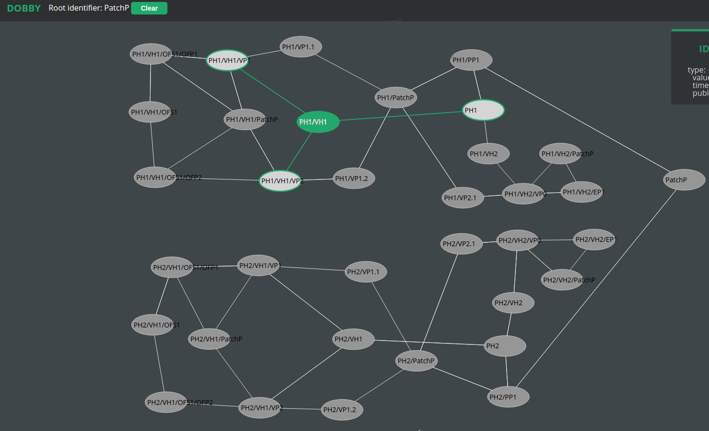

# lucet 

Lucet compiler has to “compile” the wiring connections needed for a
OpenFlow-SDN distributed machine. The "compilation" happens on two
levels:
* the topology representation in Dobby,
* configuration files for Xen and LINCX.

<!-- markdown-toc start - Don't edit this section. Run M-x markdown-toc/generate-toc again -->
**Table of Contents**

- [lucet](#lucet)
- [Configuration](#configuration)
    - [System configuration file](#system-configuration-file)
- [Building and running](#building-and-running)
- [API](#api)
    - [Wiring identifiers in Dobby](#wiring-identifiers-in-dobby)
    - [Generating domain config files for Xen](#generating-domain-config-files-for-xen)
- [Generating topologies](#generating-topologies)
- [Example](#example)
    - [Importing the topology file into Dobby](#importing-the-topology-file-into-dobby)
    - [Wiring OpenFlow ports](#wiring-openflow-ports)
    - [Wiring Endpoints with OpenFlow ports](#wiring-endpoints-with-openflow-ports)

<!-- markdown-toc end -->


# Configuration

## System configuration file

Lucet has the following options that can be adjusted in the `sys.config`:

Parameter | Description | Example
----------|-------------|-----------
dobby_node | Erlang node name that runs Dobby | 'dobby@127.0.0.1'

# Building and running

To build and run Lucet invoke `make && make run`.

# API

## Wiring identifiers in Dobby

```erlang
lucet:wire(SrcId, DstId)
```

Creates `bound_to` path between `SrcId` and `DstId` in Dobby. `SrcId`
and `DstId` are binaries for identifiers' names. 

If `ScrId` or the path doesn't exist an error is returned.

A `bound_to` path can only consist of:

1. OpenFlow Port identifiers (lm_of_port),
1. Virtual Port identifiers (lm_vp),
1. Physical Port identifiers (lm_pp),
1. Endpoint identifiers (endpoint),
1. Patch Panel identifiers (lm_patchp).

When a `bound_to` link is created between two ports, A and B, the `wires` meta-data
on their Patch Panel is updated (they have to be attached to the same Patch Panel).
Two entries are added to the `wires` meta-data map: A => B, B => A.

Each `bound_to` link between Physical Port and Virtual Port
has its corresponding xen bridge (xenbr{X} where X is a number). Before
wiring occurs, Physical Port is assumed to be linked  to the bridge
as `part of`. The wiring process is responsible for creating a `part of`
link between the bridge and VP.

Each `bound_to` link between two Virtual Ports has its corresponding
xen bridge.  The wiring process is responsible for creating an
identifier for the xen bridge and its `part of` links to the Virtual Ports.
The bridge name is `inbr_vif{X}_vif{Y}` where X and Y are vif interfaces'
numbers associated with VPs that are linked.

## Generating domain config files for Xen

```erlang
lucet:generate_lincx_domain_config(VirtalHost, MgmtIfMac)
```

Generates domain config file for LINCX Virtual Host. This function
is intended to be called after wiring is done by `lucet:wire/2`.

The `VirtualHost` is a string for VH identifier name and the `MgmtIfMac`
is the MAC address of the Management interface.


# Generating topologies ##

Lucet comes with a JSON topology generator for Dobby. It can be run like:

```shell
./utils/appfest_gen -out appfest.json -physical_ports 10 -physical_hosts 4 \
-ofp_ports 4 -virtual_hosts 1
```

The script takes the following options:

Options | Description | Default
----------|-------------|-----------
out | The output file | "out.json"
physical_hosts | Number of physcial hosts (ph) | 2
physical_ports | Number of physical ports (pp) per ph | 4
virtual hosts | Number of virtual hosts (vp) with endpoints (ep) | 1
ofp_ports | Number of OpenFlow ports per vh with OpenFlow switch (ofs) | 4

Note that the `virtual_hosts` parameter does not take into account Virtual Host
no 1 which is always assumed to be VH with OFS.

# Example

> To see larger pictures open them as `raw` github content.

This example illustrates how to use Lucet to wire a topology generated
with the following command:

```shell
./utils/appfest_gen -out topo.json -physical_ports 1 -ofp_ports 2 -virtual_hosts 1 -physical_hosts 2
```
A picture below shows the topology in the Dobby Visualizer tool:



After the wiring we expect that:


1. Port 1 of OpenFlow Switch 1 on Physical Host 1 (PH1/VH1/OFS1/OFP1)
will be bound to Port 1 of OpenFlow Switch 1 on Physical Host 2 (PH2/VH1/OFS1/OFP1).
This indicates that:
    1. On Physical Host 1, Port 1 of OpenFlow Switch 1 (PH1/VH1/OFS1/OFP1)
    will be bound to Physical Port 1 (PH1/PP1),
    1. On Physical Host 2, Port 1 of OpenFlow Switch 1 (PH2/VH1/OFS1/OFP1)
    will be bound to Physical Port 1 (PH2/PP1).
1. On Physical Host 1, Port 2 of OpenFlow Switch 1 (PH1/VH1/OFS1/OFP2) will
be bound to Endpoint1 on Virtual Host 2.
1. On Physical Host 1, Port 2 of OpenFlow Switch 1 (PH2/VH1/OFS1/OFP2) will
be bound to Endpoint1 on Virtual Host 2.

## Importing the topology file into Dobby

Start the Dobby service and import the topology json file:

```erlang
dby_bulk:import(json, "{PATH}/out.json").
```

Verify that the topology is imported:

```erlang
3> dby:links(<<"PH1">>).
[{<<"PH1/PP1">>,
  #{<<"type">> => #{publisher_id => <<"lucet">>,
      timestamp => <<"2015-05-26T16:22:02Z">>,
      value => <<"part_of">>}}}]
```

## Wiring OpenFlow ports

Before calling Lucet API make sure that it is connected to Dobby. Calling
`nodes()` in Lucet shell should return something like `['dobby@127.0.0.1']`.

```erlang
lucet:wire(<<"PH1/VH1/OFS1/OFP1">>, <<"PH1/PP1">>).
lucet:wire(<<"PH1/PP1">>, <<"PH2/PP1">>).
lucet:wire(<<"PH2/VH1/OFS1/OFP1">>, <<"PH2/PP1">>).
```

Now, the topology representation should look like on the picture below:


In comparison to the initial picture there are 7 new links:

1. A `part_of` link between `PH1/xenbr1` and `PH1/VP1.1`.
2. A `bound_to` link between `PH1/PP1` and `PH1/VP1.1`.
3. A `connected_to` link between `PH/PP1` and `PH1/VH1/OFS1/OFP1`.
4. 3 analogous links to 1. 2. and 3. for `PH2`.
2. A `connected_to` link between `PH1/PP1` and `PH2/PP1`.

> We cannot do it with
>
> `lucet:wire(<<"PH1/VH1/OFS1/OFP1">>, <<"PH2/VH1/OFS1/OFP1">>)`
>
> because Lucet wouldn't know which PPs to use
> (for example it could choose that PP1/PP1 will be connected to PH2/PP3). 
> However, if we want to have a `connected_to` link between the OpenFlow
> Ports we can call
>
> `lucet:wire(<<"PH1/VH1/OFS1/OFP1">>, <<"PH2/VH1/OFS1/OFP1">>).`
>
> **after all the above commands**. 

## Wiring Endpoints with OpenFlow ports

```erlang
lucet:wire(<<"PH1/VH1/OFS1/OFP2">>, <<"PH1/VH2/EP1">>).
lucet:wire(<<"PH2/VH1/OFS1/OFP2">>, <<"PH2/VH2/EP1">>).
```

After this call the topology will change into this:


In comparion to the previous state it has 2 new identifers, and 8 new links.
The identifiers are:

1. Xen brdige between Virtual Ports of Virtual Host 1 and 2 on Physical
Host 1: `PH1/inbr_vif1.2_vif2.1`
2. Xen brdige between Virtual Ports of Virtual Host 1 and 2 on Physical
Host 2: `PH2/inbr_vif1.2_vif2.1`.

And the links:

1. A `part_of` link between `PH1/inbr_vif1.2_vif2.1` and `PH1/VP1.2`.
1. A `part_of` link between `PH1/inbr_vif1.2_vif2.1` and `PH1/VP2.1`.
1. A `bound_to` link between `PH1/VP1.2` and `PH1/VP2.1`.
1. A `connected_to` link between `PH1/VH1/OFS1/OFP2` and `PH1/VH2/EP1`.
1. 4 analogous links to the above but for `PH2`.
